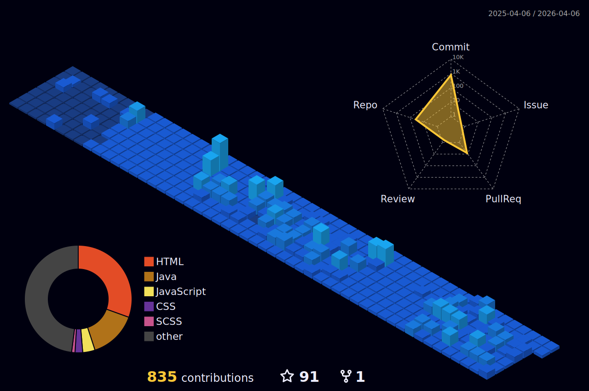

### Olá, pessoal!

### Eu me chamo Gabriel e sou um jovem estudante que está iniciando sua carreira profissional.
### Por enquanto eu não estou em um trabalho na área de programação, mas, estou procurando fazer o máximo de cursos e estudos sobre programação em geral, porque é a área que eu sonho trabalhar.
##

  <3>Gostos:</h3>

  
→ Programar; 🖥👾

  
→ Videogames; 🕹🎮

  
→ Tocar instrumentos; 🎸

  
##

   
   

##

  <h3>Linguagens e Ferramentas:</h3>
  
  
  
  
  
  
  
  
  
  
  
  
  
  
  
  
  
  
  
  
  
  
  
  
  
  
  

##

  <h3>Streak:</h3>

